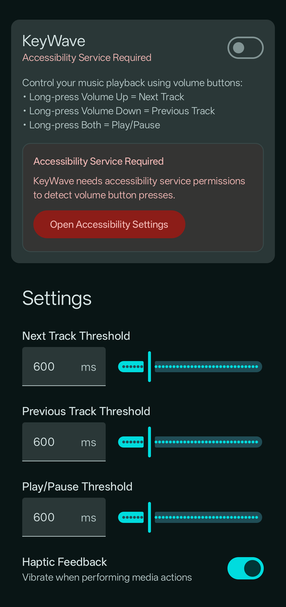
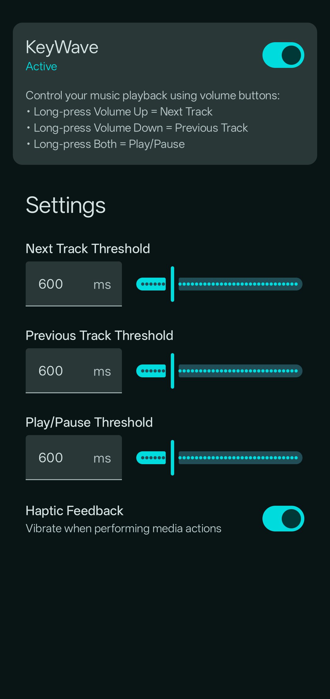

# KeyWave

Control your music with volume keys when your screen is off.

## What it does

I got tired of having to pull out my phone and unlock it just to skip a song, so I built this. KeyWave lets you control music playback using your volume keys even when the screen is off.

Long press volume up to skip to the next track, long press volume down for previous track, or long press both keys together to play/pause. Regular short presses still work normally for volume control.

## Features

- **Screen-off controls** - Works when your phone screen is off
- **Next track** - Long press volume up
- **Previous track** - Long press volume down  
- **Play/pause** - Long press both volume keys
- **Normal volume** - Short presses work as usual
- **Smart activation** - Only responds when music apps are actively playing
- **Customizable timing** - Adjust how long you need to hold the keys
- **Advanced haptic feedback** - Rich vibration options with multiple modes:
  - **Simple** - Single vibration for all actions
  - **Distinct per Action** - Configurable pulses and intensity for each action (1-5 pulses, adjustable intensity)
  - **Gentle/Strong** - Pre-defined intensity levels
  - **Custom** - Set different vibration modes for each individual action
  - **Advanced Custom** - Create completely custom vibration patterns with precise timing, multiple pulses, and variable intensities
- **Battery efficient** - Runs in background without draining your battery
- **Works with most music apps** - Uses standard Android media controls
- **Debug monitoring** - Optional detailed logging for troubleshooting

## How it works

The app uses Android's Accessibility Service to capture volume key presses globally, and a Notification Listener Service to detect when music apps are playing. When it detects a long press while media is active, it blocks the normal volume change and sends the music command instead, optionally providing haptic feedback based on your configured vibration settings. This ensures the app only interferes with normal volume controls when you're actually listening to music.

The advanced vibration system allows for sophisticated haptic feedback patterns - from simple single vibrations to complex multi-pulse sequences with variable timing and intensity. Patterns are stored persistently and can be customized per action for a truly personalized experience.

## Setup

1. Install the app
2. Grant Accessibility Service permission (the app will walk you through this)
3. Grant Notification Listener permission (required to detect active music apps)
4. Enable the KeyWave service in the app settings
5. Adjust long-press durations if needed
6. Configure vibration feedback:
   - Choose from multiple vibration modes (Simple, Distinct, Custom, Advanced)
   - For Distinct mode: Set number of pulses (1-5) and intensity for each action
   - For Custom mode: Choose different vibration styles per action
   - For Advanced mode: Create custom patterns with precise timing and multiple pulses
7. Test it out with your music app

## Permissions

- **Accessibility Service** - Required to capture volume key presses when screen is off
- **Notification Access** - Required to detect when music apps are actively playing
- **Foreground Service** - Keeps the service running in background

## Building

Clone the repo and open in Android Studio. Standard Android build process.

```bash
git clone https://github.com/tibor1234567895/KeyWave.git
```

## Screenshots




## Contributing

Bug reports and feature requests welcome. Pull requests too.

## License

[MIT License](LICENSE)
